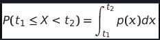

> Statistics and Probability Theory are two highly related areas of Mathematics that are highly relevant to Data Science.
It is possible to operate with data without deep knowledge of mathematics

## Probability and Random Variables
**Probability** is a number between 0 and 1 that expresses how probable an event is. It is defined as a number of positive 
outcomes (that lead to the event), divided by total number of outcomes, given that all outcomes are equally probable.
For example, when we roll a dice, the probability that we get an even number is 3/6 = 0.5.

When we talk about events, we use random variables. For example, the **random variable** that represents a number obtained when
rolling a dice would take values from 1 to 6. Set of numbers from 1 to 6 is called **sample space**. We can talk about the probability
of a random variable taking a certain value, for example P(X=3)=1/6.

The random variable in previous example is called **discrete**, because it has a countable sample space, i.e. there are separate values that
can be enumerated. There are cases when sample space is a range of real numbers, or the whole set of real numbers. Such variables are called
continuous. A good example is the time when the bus arrives.

## Probability Distribution
In the case of discrete random variables, it is easy to describe the probability of each event by a function P(X). For each value s from 
sample space S it will give a number from 0 to 1, such that the sum of all values of P(X=s) for all events would be 1.

The most well-known discrete distribution is **uniform distribution**, in which there is a sample space of N elements, with equal probability
of 1/N for each of them.

It is more difficult to describe the probability distribution of a continuous variable, with values drawn from some interval [a,b], or the whole
set of real numbers ℝ. Consider the case of bus arrival time. In fact, for each exact arrival time t, the probability of a bus arriving at exactly
that time is 0!

>Now you know that events with 0 probability happen, and very often! At least each time when the bus arrives!

We can only talk about the probability of a variable falling in a given interval of values, eg. P(t1≤X<t2). In this case, probability distribution is
described by a probability density function p(x), such that

A continuous analog of uniform distribution is called **continuous uniform**, which is defined on a finite interval. A probability that the value X falls
into an interval of length l is proportional to l, and rises up to 1.

