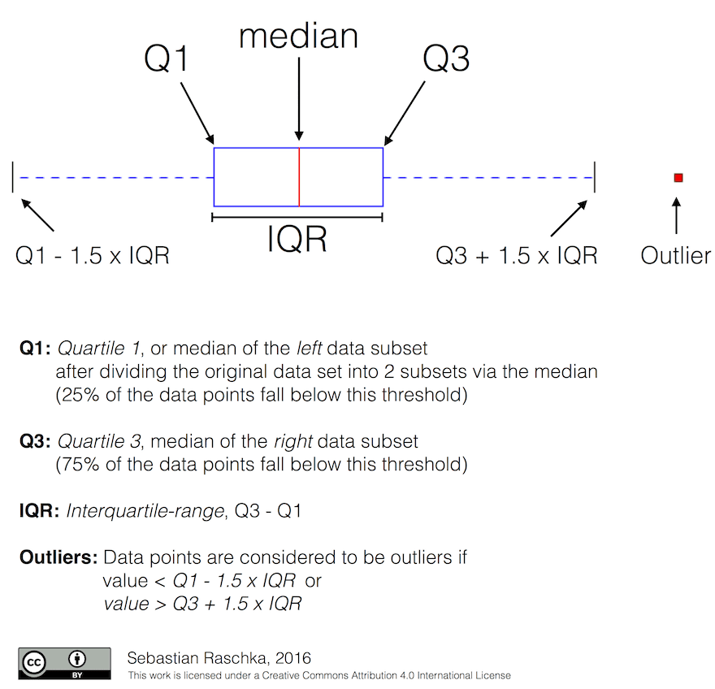
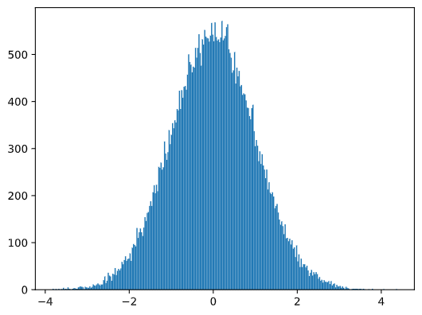

> Statistics and Probability Theory are two highly related areas of Mathematics that are highly relevant to Data Science.
It is possible to operate with data without deep knowledge of mathematics

## Probability and Random Variables
**Probability** is a number between 0 and 1 that expresses how probable an event is. It is defined as a number of positive 
outcomes (that lead to the event), divided by total number of outcomes, given that all outcomes are equally probable.
For example, when we roll a dice, the probability that we get an even number is 3/6 = 0.5.

When we talk about events, we use random variables. For example, the **random variable** that represents a number obtained when
rolling a dice would take values from 1 to 6. Set of numbers from 1 to 6 is called **sample space**. We can talk about the probability
of a random variable taking a certain value, for example P(X=3)=1/6.

The random variable in previous example is called **discrete**, because it has a countable sample space, i.e. there are separate values that
can be enumerated. There are cases when sample space is a range of real numbers, or the whole set of real numbers. Such variables are called
continuous. A good example is the time when the bus arrives.

## Probability Distribution
In the case of discrete random variables, it is easy to describe the probability of each event by a function P(X). For each value s from 
sample space S it will give a number from 0 to 1, such that the sum of all values of P(X=s) for all events would be 1.

The most well-known discrete distribution is **uniform distribution**, in which there is a sample space of N elements, with equal probability
of 1/N for each of them.

It is more difficult to describe the probability distribution of a continuous variable, with values drawn from some interval [a,b], or the whole
set of real numbers ℝ. Consider the case of bus arrival time. In fact, for each exact arrival time t, the probability of a bus arriving at exactly
that time is 0!

>Now you know that events with 0 probability happen, and very often! At least each time when the bus arrives!

We can only talk about the probability of a variable falling in a given interval of values, eg. P(t1≤X<t2). In this case, probability distribution is
described by a probability density function p(x), such that


A continuous analog of uniform distribution is called **continuous uniform**, which is defined on a finite interval. A probability that the value X falls
into an interval of length l is proportional to l, and rises up to 1.

## Mean, Variance and Standard Deviation
Suppose we draw a sequence of n samples of a random variable X: x1, x2, ..., xn. We can define mean (or **arithmetic average**) value of the sequence in the
traditional way as (x1+x2+xn)/n. As we grow the size of the sample (i.e. take the limit with n→∞), we will obtain the mean (also called **expectation**) of 
the distribution. We will denote expectation by E(x).

> It can be demonstrated that for any discrete distribution with values {x1, x2, ..., xN} and corresponding probabilities p1, p2, ..., pN, the expectation would equal to E(X)=x1p1+x2p2+...+xNpN.

To identify how far the values are spread, we can compute the variance σ2 = ∑(xi - μ)2/n, where μ is the mean of the sequence. The value σ is called **standard
deviation**, and σ2 is called a variance.

## Mode, Median and Quartiles
Sometimes, mean does not adequately represent the "typical" value for data. For example, when there are a few extreme values that are completely out of range, 
they can affect the mean. Another good indication is a **median**, a value such that half of data points are lower than it, and another half - higher.

To help us understand the distribution of data, it is helpful to talk about quartiles:

- First quartile, or Q1, is a value, such that 25% of the data fall below it
- Third quartile, or Q3, is a value that 75% of the data fall below it

Graphically we can represent relationship between median and quartiles in a diagram called the box plot:


Here we also compute **inter-quartile** range IQR=Q3-Q1, and so-called outliers - values, that lie outside the boundaries [Q1-1.5IQR,Q3+1.5IQR].

For finite distribution that contains a small number of possible values, a good "typical" value is the one that appears the most frequently, which is called **mode**.
It is often applied to categorical data, such as colors. Consider a situation when we have two groups of people - some that strongly prefer red, and others who
prefer blue. If we code colors by numbers, the mean value for a favorite color would be somewhere in the orange-green spectrum, which does not indicate the actual
preference on neither group. However, the mode would be either one of the colors, or both colors, if the number of people voting for them is equal (in this case we
call the sample **multimodal**).

## Real World Data
When we analyze data from real life, they often are not random variables as such, in a sense that we do not perform experiments with unknown result. For example,
consider a team of baseball players, and their body data, such as height, weight and age. Those numbers are not exactly random, but we can still apply the same
mathematical concepts. For example, a sequence of people's weights can be considered to be a sequence of values drawn from some random variable. Below is the
sequence of weights of actual baseball players from Major League Baseball, taken from this dataset (for your convenience, only first 20 values are shown):

```
[180.0, 215.0, 210.0, 210.0, 188.0, 176.0, 209.0, 200.0, 231.0, 180.0, 188.0, 180.0, 185.0, 160.0, 180.0, 185.0, 197.0, 189.0, 185.0, 219.0]
```

Here is the box plot showing mean, median and quartiles for our data:


Since our data contains information about different player **roles**, we can also do the box plot by role - it will allow us to get the idea on how parameters values
differ across roles. This time we will consider height:


This diagram suggests that, on average, height of first basemen is higher that height of second basemen. Later in this lesson we will learn how we can test this
hypothesis more formally, and how to demonstrate that our data is statistically significant to show that.

> When working with real-world data, we assume that all data points are samples drawn from some probability distribution. This assumption allows us to apply machine
learning techniques and build working predictive models.

To see what the distribution of our data is, we can plot a graph called a **histogram**. X-axis would contain a number of different weight intervals (so-called **bins**),
and the vertical axis would show the number of times our random variable sample was inside a given interval.


From this histogram you can see that all values are centered around certain mean weight, and the further we go from that weight - the fewer weights of that value are
encountered. I.e., it is very improbable that the weight of a baseball player would be very different from the mean weight. Variance of weights show the extent to
which weights are likely to differ from the mean.

> If we take weights of other people, not from the baseball league, the distribution is likely to be different. However, the shape of the distribution will be the same,
but mean and variance would change. So, if we train our model on baseball players, it is likely to give wrong results when applied to students of a university, because
the underlying distribution is different.

## Normal Distribution
The distribution of weights that we have seen above is very typical, and many measurements from real world follow the same type of distribution, but with different mean
and variance. This distribution is called **normal distribution**, and it plays a very important role in statistics.

Using normal distribution is a correct way to generate random weights of potential baseball players. Once we know mean weight mean and standard deviation std, we can
generate 1000 weight samples in the following way:

```
samples = np.random.normal(mean,std,1000)
```
If we plot the histogram of the generated samples we will see the picture very similar to the one shown above. And if we increase the number of samples and the number
of bins, we can generate a picture of a normal distribution that is more close to ideal:



Normal Distribution with mean=0 and std.dev=1

## Confidence Intervals
When we talk about weights of baseball players, we assume that there is certain random variable W that corresponds to ideal probability distribution of weights of all
baseball players (so-called **population**). Our sequence of weights corresponds to a subset of all baseball players that we call **sample**. An interesting question is, can
we know the parameters of distribution of W, i.e. mean and variance of the population?

The easiest answer would be to calculate mean and variance of our sample. However, it could happen that our random sample does not accurately represent complete population.
Thus it makes sense to talk about confidence interval.

> Confidence interval is the estimation of true mean of the population given our sample, which is accurate is a certain probability (or level of confidence).

Suppose we have a sample X1, ..., Xn from our distribution. Each time we draw a sample from our distribution, we would end up with different mean value μ. Thus μ can be
considered to be a random variable. A **confidence interval** with confidence p is a pair of values (Lp,Rp), such that P(Lp≤μ≤Rp) = p, i.e. a probability of measured mean 
value falling within the interval equals to p.

It does beyond our short intro to discuss in detail how those confidence intervals are calculated. Some more details can be found on Wikipedia. In short, we define the
distribution of computed sample mean relative to the true mean of the population, which is called **student distribution**.

If we want to estimate the mean μ of our population with confidence p, we need to take (1-p)/2-th percentile of a Student distribution A, which can either be taken from
tables, or computer using some built-in functions of statistical software (eg. Python, R, etc.). Then the interval for μ would be given by X±A*D/√n, where X is the
obtained mean of the sample, D is the standard deviation.

An example of calculating confidence interval for weights and heights is given in the [accompanying notebooks]().

| p    | Weight mean |
|------|-------------|
| 0.85 | 201.73±0.94 |
| 0.90 | 201.73±1.08 |
| 0.95 | 201.73±1.28 |


Notice that the higher is the confidence probability, the wider is the confidence interval. 


